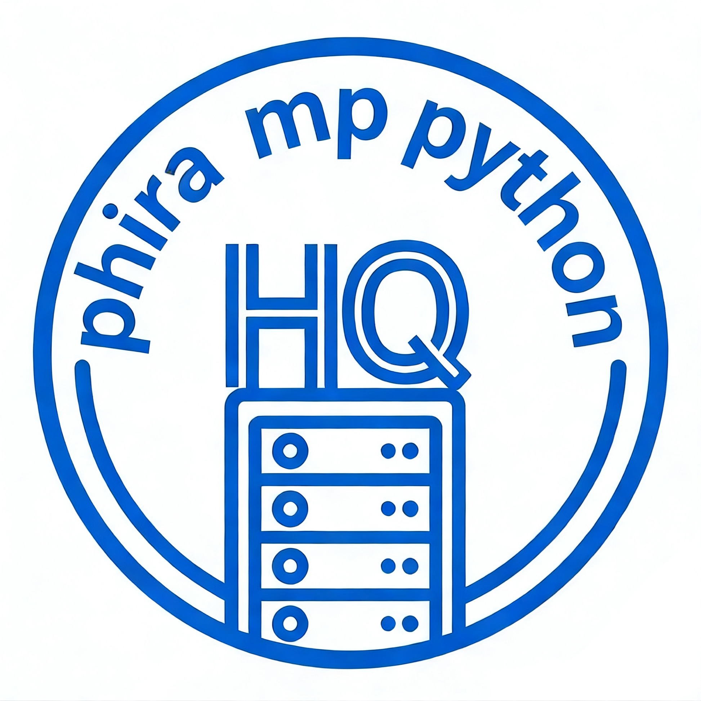

<div align="center">
  <h1>phira-mp-python</h1>
  <h3>一个基于 Python asyncio 的 <b>Phira</b> 多人游戏服务器，使用开源项目https://github.com/Evi233/pyphira-mp修改开发</h3>
  <h5><i>正在积极测试中，可能不稳定，如遇任何问题，欢迎提供反馈和建议！</i></h5>
</div>

## 介绍

phira-mp- python 是**完全独立**的 Phira 多人游戏服务器端实现  
独立实现了 [phira-mp](https://github.com/TeamFlos/phira-mp) 的网络协议和游戏逻辑而不基于其源码

允许玩家:
* 创建房间
* 共同游玩谱面
* 管理游戏状态

与原版 phira-mp 的不同且需要注意的差异:
* 断线重连不会自动重新加入房间
* 房主退出房间时会重新指定新的房主
* 没有实现完整的monitor能力

---

## 如何使用

### 环境要求
- Python 3.7+

### 安装与启动

1. **克隆项目**：
```bash
git clone https://gitee.com/huqi_awa/phira-mp-python.git
cd pyphira-mp
```

2. **安装依赖**：
```bash
pip install -r requirements.txt
```

3. **启动服务器**：
```bash
python main.py
```
服务器默认运行在 `0.0.0.0:12348`
web服务器运行在 `0.0.0.0:8081`
管理员面板运行在 `0.0.0.0:8082`
首次启动服务器请在index.html的140行的severAddr后改为服务器真正地址。如果不需要复制地址功能，请直接删除第140行
首次启动前在admin.py修改你的管理员账户名和密码
首次启动请到web.py中修改外部api


### 配置说明

**服务器地址/端口**：在 `main.py` 中修改 `HOST` 和 `PORT`，在web.py中修改'web_port'在admin.py中修改'admin_port'

**Monitor权限 (未实现)**：在 `monitors.txt` 中每行添加一个用户 ID

**国际化文本**：修改 `i10n/zh-rCN.json`

**接入外部api**:在web.py中添加地址

---

## 贡献

欢迎提交 Issue 和 Pull Request！

---

## 致谢

- **[jphira-mp-protocol](https://github.com/lRENyaaa/jphira-mp-protocol)**：Phira 协议实现
- 原项目：https://github.com/Evi233/pyphira-mp


---


## 许可证

本项目采用 **GPL v3** 许可证 - 查看 [LICENSE](./LICENSE) 文件了解详情
